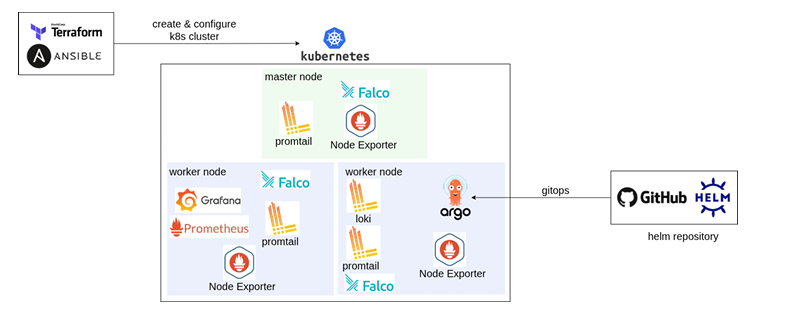

# 🔐 Kubernetes Infrastructure Security & Automation Platform


> Automated deployment of a Kubernetes infrastructure using **Terraform** and **Ansible**, integration of a **GitOps** pipeline with **ArgoCD**, and implementation of a complete observability and security platform based on **Prometheus**, **Grafana**, **Loki**, **Promtail**, and **Falco**.

---

# 📖 Overview

This project aims to automate the deployment of a secure Kubernetes infrastructure by applying DevOps and DevSecOps best practices.

The infrastructure is fully deployed on **VMware Workstation Pro** from an **Ubuntu Server virtual machine** used as a template.

The cluster virtual machines are automatically provisioned using **Terraform**, then configured using **Ansible**.

Once the Kubernetes cluster is operational, several components are deployed to provide:

* GitOps management with ArgoCD;
* Infrastructure monitoring with Prometheus;
* Centralized logging with Loki;
* Metrics and log visualization with Grafana;
* Real-time anomaly and suspicious behavior detection with Falco.

---

# 🏗 Architecture



```text
docs/architecture.png
```

The architecture is composed of the following components:

* **Ubuntu Desktop (Host)**
* **VMware Workstation Pro**
* **1 Ubuntu Server Template VM**
* **3 Kubernetes Virtual Machines**

  * 1 Master
  * 2 Workers
* **Terraform**
* **Ansible**
* **Kubernetes**
* **Helm**
* **ArgoCD**
* **Prometheus**
* **Grafana**
* **Loki**
* **Promtail**
* **Node Exporter**
* **Falco**

---

# 🎯 Objectives

This project addresses the following objectives:

* Automate Kubernetes infrastructure creation;
* Apply security hardening before installation;
* Automatically deploy the Kubernetes cluster;
* Implement a GitOps approach;
* Monitor the entire infrastructure;
* Centralize node and container logs;
* Detect security anomalies in real time.

---

# 🛠 Technologies Used

| Tool                   | Role                              |
| ---------------------- | --------------------------------- |
| Terraform              | Virtual machine provisioning      |
| VMware Workstation Pro | Virtualization                    |
| Ubuntu Server          | Operating system                  |
| Ansible                | Automated configuration           |
| Kubernetes             | Container orchestration           |
| Helm                   | Kubernetes application management |
| ArgoCD                 | GitOps deployment                 |
| Prometheus             | Metrics collection                |
| Grafana                | Visualization                     |
| Loki                   | Log aggregation                   |
| Promtail               | Log collection                    |
| Node Exporter          | System metrics                    |
| Falco                  | Intrusion and anomaly detection   |

---

# 🚀 Project Workflow

## 1. Creating the Virtual Machine Template

An Ubuntu Server virtual machine is manually created on VMware Workstation Pro.

This VM is prepared with:

* OpenSSH Server;
* Network configuration;
* Administrator user;
* VMware Tools;
* SSH keys;
* System updates.

This machine becomes the **template** used by Terraform.

---

## 2. Automated Provisioning with Terraform

Terraform is used to automate cluster deployment.

It automatically performs:

* Ubuntu Server template cloning;
* Creation of the three virtual machines;
* Resource allocation (CPU, RAM, disk);
* Network configuration;
* Automatic generation of the **inventory** file used by Ansible.

The resulting cluster contains:

```text
Master
Worker-1
Worker-2
```

---

## 3. Automated Configuration with Ansible

Once the machines are created, Ansible fully configures the infrastructure.

The playbooks are executed in the following order.

---

## 🔒 Security Hardening

Before installing Kubernetes, several security measures are applied:

* Root login disabled;
* SSH key-based authentication;
* Firewall configuration;
* System updates;
* Sysctl configuration;
* SSH hardening;
* Removal of unnecessary services.

---

## ☸ Kubernetes Installation

Automatic installation of:

* containerd;
* kubeadm;
* kubelet;
* kubectl.

Then:

* Master initialization;
* Token retrieval;
* Automatic Worker nodes joining.

The Kubernetes cluster becomes fully operational.

---

## ⚓ Helm Installation

Helm is installed to simplify Kubernetes application deployment.

---

## 🔄 GitOps Deployment with ArgoCD

ArgoCD is installed on the cluster.

It monitors a Git repository containing Kubernetes manifests.

Every repository change is automatically synchronized with the cluster.

---

## 📊 Monitoring with Prometheus

Prometheus collects the following metrics:

* CPU usage;
* Memory usage;
* Disk usage;
* Network metrics;
* Kubernetes metrics.

---

## 📈 Grafana

Grafana provides visualization for:

* Prometheus metrics;
* Loki logs.

Dashboards simplify monitoring of the entire Kubernetes cluster.

---

## 📝 Centralized Logging

### Loki

Loki stores application and node logs.

### Promtail

Promtail is deployed as a **DaemonSet**.

It automatically collects:

* System logs;
* Kubernetes logs;
* Container logs.

---

## 📡 Node Exporter

Node Exporter is deployed as a **DaemonSet** to expose system metrics from every node.

---

## 🛡 Runtime Security with Falco

Falco continuously monitors container activity.

It detects:

* Interactive shells;
* Suspicious access to sensitive files;
* Privilege escalation;
* Abnormal behaviors.

---

# 🔄 GitOps Workflow

```text
GitHub
   │
   ▼
ArgoCD
   │
   ▼
Automatic Synchronization
   │
   ▼
Kubernetes Cluster
```

The Git repository acts as the single source of truth.

Any modification to Kubernetes manifests is automatically applied to the cluster.

---

# 📦 Deployment

## Virtual Machine Provisioning

```bash
cd terraform

terraform init

terraform plan

terraform apply
```

## Cluster Deployment

```bash
cd ../ansible

ansible-playbook playbooks/hardening.yml

ansible-playbook playbooks/kubernetes.yml

ansible-playbook playbooks/helm.yml

ansible-playbook playbooks/argocd.yml

ansible-playbook playbooks/monitoring.yml

ansible-playbook playbooks/logging.yml

ansible-playbook playbooks/falco.yml
```

---

# 📊 Final Result

At the end of deployment, the infrastructure includes:

* ✅ A Kubernetes cluster composed of one Master and two Workers.
* ✅ Automated provisioning using Terraform.
* ✅ Complete configuration using Ansible.
* ✅ A secured cluster through hardening practices.
* ✅ A GitOps platform using ArgoCD.
* ✅ Centralized monitoring with Prometheus and Grafana.
* ✅ Centralized logging using Loki and Promtail.
* ✅ System monitoring using Node Exporter.
* ✅ Real-time anomaly detection using Falco.

---

# 🔮 Possible Improvements

* Kubernetes Control Plane High Availability;
* Integration of Alertmanager;
* Deployment on VMware vSphere;
* Deployment on AWS, Azure, or GCP;
* Integration of HashiCorp Vault;
* Container image scanning with Trivy;
* Security policies using Kyverno or OPA Gatekeeper;
* CI/CD pipeline using GitHub Actions or GitLab CI.

---

# 👥 Authors

This project was developed as a team project as part of a semester-end project focused on Kubernetes infrastructure automation, security, and observability.

## Team Members

## My Contribution

I mainly contributed to the following aspects:

* Kubernetes cluster deployment and configuration;
* Helm installation and configuration;
* Deployment and configuration of ArgoCD to implement the GitOps workflow;
* Integration of the Prometheus, Grafana, and Loki monitoring stack.
